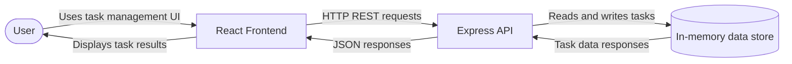
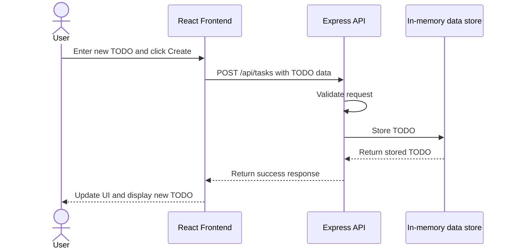

# TODO Application Cloud Architecture Overview

## System Context

## Create TODO Workflow

When the user submits a new TODO, the React frontend sends the task data to the Express API using `POST /api/tasks`. The API validates the request, stores the TODO in the in-memory data store, and returns a success response. The frontend then refreshes its task data and displays the new TODO to the user.

## Components

- **User:** Creates, edits, completes, and deletes TODO tasks through the application interface.
- **React Frontend:** Provides the browser-based task form and task list, manages user interactions, and communicates with the backend through REST requests.
- **Express API:** Exposes the `/api/tasks` endpoints, validates task requests, handles task operations, and returns JSON responses to the frontend.
- **In-memory data store:** Stores task records for the running application process. The current backend uses an in-memory SQLite database, so data is lost when the backend process stops.
